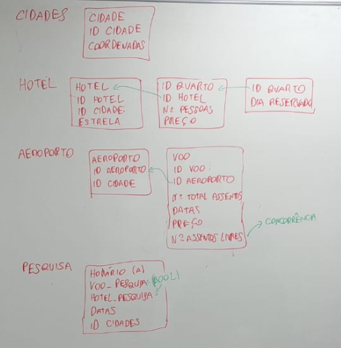
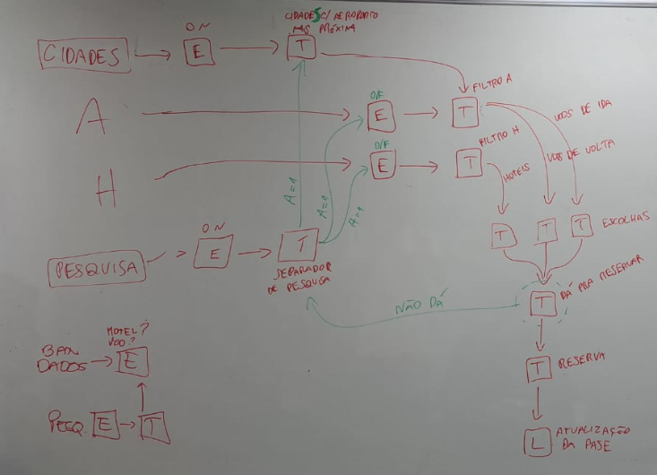

# Sistema de Reserva de Viagens

## Visão Geral
Este projeto modela um sistema de reserva de viagens, permitindo que os usuários reservem voos, hotéis ou ambos simultaneamente. O desenvolvimento está sendo realizado como parte da disciplina de Computação Escalável.

## Modelagem do Sistema
A modelagem do sistema foi elaborada com base em diagramas representados abaixo.

### Planejamento da base de dados

### Planejamento do fluxo ETL

## Tecnologias Utilizadas
- Linguagem de programação: **C++, Python**

## Como Executar
1. Clone este repositório.

## Autores
Projeto desenvolvido por [Gustavo Tironi](https://github.com/gtironi), [Kauan](), [Matheus](), [Pedro](), [Sillas]()
